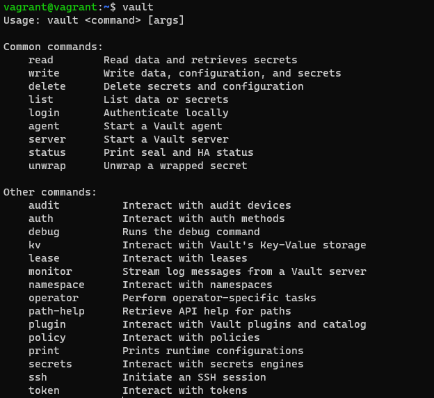
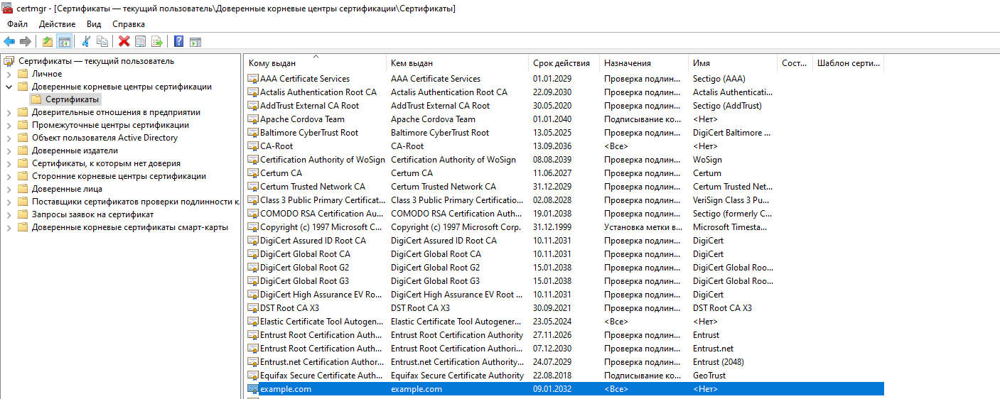
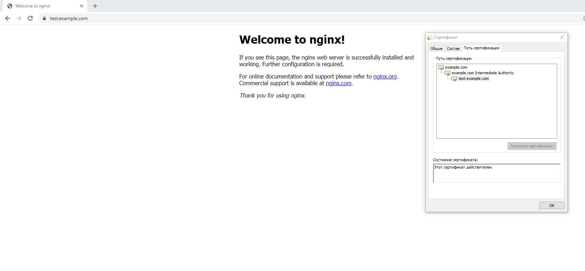

###### 1. Создайте виртуальную машину Linux.
Linux машина поднята с помощью vagrant. Параметры виртуальной машины взяты из лекции "3.1. Работа в терминале, лекция 1"
Содержимое файла vagrant.file:

    Vagrant.configure("2") do |config|
        config.vm.box = "bento/ubuntu-20.04"
     end

###### 2. Установите ufw и разрешите к этой машине сессии на порты 22 и 443, при этом трафик на интерфейсе localhost (lo) должен ходить свободно на все порты.
Установка:

    sudo apt install ufw

Запуск:

    sudo ufw enable

Открытие портов:
    
    sudo ufw allow 443
    sudo ufw allow 22

Разрешение всех соединений на localhost:

    sudo ufw allow from 127.0.0.1

Проверка правил:

    sudo ufw status numbered
    Status: active

         To                         Action      From
         --                         ------      ----
    [ 1] 443                        ALLOW IN    Anywhere
    [ 2] 22                         ALLOW IN    Anywhere
    [ 3] Anywhere                   ALLOW IN    127.0.0.1

###### 3. Установите hashicorp vault.
Готово:

    curl -fsSL https://apt.releases.hashicorp.com/gpg | sudo apt-key add -
    sudo apt-add-repository "deb [arch=amd64] https://apt.releases.hashicorp.com $(lsb_release -cs) main"
    sudo apt-get update && sudo apt-get install vault
    vault --version

###### 4. Создайте центр сертификации по инструкции (ссылка), и выпустите сертификат для использования его в настройке веб-сервера nginx (срок жизни сертификата - месяц).

    screen -S Vault
    vault server -dev -dev-root-token-id root
    ctrl+a d
    export VAULT_ADDR=http://127.0.0.1:8200
    export VAULT_TOKEN=root

Step 1: Generate root CA

    vault secrets enable pki
    vault secrets tune -max-lease-ttl=87600h pki
    
    vault write -field=certificate pki/root/generate/internal \
         common_name="example.com" \
         ttl=87600h > CA_cert.crt
    vault write pki/config/urls \
         issuing_certificates="$VAULT_ADDR/v1/pki/ca" \
         crl_distribution_points="$VAULT_ADDR/v1/pki/crl"

Step 2: Generate intermediate CA

    vault secrets enable -path=pki_int pki
    vault secrets tune -max-lease-ttl=43800h pki_int
    apt install jq
    
    vault write -format=json pki_int/intermediate/generate/internal \
         common_name="example.com Intermediate Authority" \
         | jq -r '.data.csr' > pki_intermediate.csr
    vault write -format=json pki/root/sign-intermediate csr=@pki_intermediate.csr \
         format=pem_bundle ttl="43800h" \
         | jq -r '.data.certificate' > intermediate.cert.pem
    vault write pki_int/intermediate/set-signed certificate=@intermediate.cert.pem

Step 3: Create a role

    vault write pki_int/roles/example-dot-com \
         allowed_domains="example.com" \
         allow_subdomains=true \
         max_ttl="750h"

Step 4: Request certificate
    
    vault write -format=json pki_int/issue/example-dot-com common_name="test.example.com" ttl="750h" > test_cert.example.com.json_data

### UPD
### Так как есть задача на выпуск сертификата с помощью скрипта, то запуск vault в dev режиме в дальнейшем нецелесообразен. Ниже выполненные команды для запуска vault как службы с конфигурацией по умолчанию:
        
    sudo systemctl enable vault.service
    sudo systemctl start vault.service
    vagrant@vagrant:/opt/vault$ sudo systemctl status vault.service

    ● vault.service - "HashiCorp Vault - A tool for managing secrets"
         Loaded: loaded (/lib/systemd/system/vault.service; enabled; vendor preset: enabled)
         Active: active (running) since Fri 2022-05-14 14:39:28 UTC; 10s ago
           Docs: https://www.vaultproject.io/docs/
       Main PID: 14034 (vault)
          Tasks: 7 (limit: 1072)
         Memory: 68.2M
         CGroup: /system.slice/vault.service
                 └─14034 /usr/bin/vault server -config=/etc/vault.d/vault.hcl

Инициализация vault:
    
    vault operator init
    Unseal Key 1: <Unseal Key 1>
    Unseal Key 2: <Unseal Key 2>
    Unseal Key 3: <Unseal Key 3>
    Unseal Key 4: <Unseal Key 4>
    Unseal Key 5: <Unseal Key 5>
    
    Initial Root Token: <root token>
    
    Vault initialized with 5 key shares and a key threshold of 3. Please securely
    distribute the key shares printed above. When the Vault is re-sealed,
    restarted, or stopped, you must supply at least 3 of these keys to unseal it
    before it can start servicing requests.
    
    Vault does not store the generated master key. Without at least 3 keys to
    reconstruct the master key, Vault will remain permanently sealed!
    
    It is possible to generate new unseal keys, provided you have a quorum of
    existing unseal keys shares. See "vault operator rekey" for more information.

Распечатка vault (команду нужно запустить три раза, каждый раз вводить один из Unseal Key, в конечном итоге должно быть введено 3 из 5 Unseal Key):

    vault operator unseal
    Unseal Key (will be hidden):
    Key                Value
    ---                -----
    Seal Type          shamir
    Initialized        true
    Sealed             true
    Total Shares       5
    Threshold          3
    Unseal Progress    1/3
    Unseal Nonce       c196da6d-90f6-ae52-e161-a3907bf372ae
    Version            1.9.2
    Storage Type       file
    HA Enabled         false

    vault operator unseal
    Unseal Key (will be hidden):
    Key                Value
    ---                -----
    Seal Type          shamir
    Initialized        true
    Sealed             true
    Total Shares       5
    Threshold          3
    Unseal Progress    2/3
    Unseal Nonce       c196da6d-90f6-ae52-e161-a3907bf372ae
    Version            1.9.2
    Storage Type       file
    HA Enabled         false

После третьего этапа распечатки параметр Sealed получит свойство "false":

    vault operator unseal
    Unseal Key (will be hidden):
    Key             Value
    ---             -----
    Seal Type       shamir
    Initialized     true
    Sealed          false
    Total Shares    5
    Threshold       3
    Version         1.9.2
    Storage Type    file
    Cluster Name    vault-cluster-091301ae
    Cluster ID      c929d336-c6d9-2b11-3d84-00bfcd90484a
    HA Enabled      false

###### 5. Установите корневой сертификат созданного центра сертификации в доверенные в хостовой системе.

    Готово.

###### 6. Установите nginx.

    sudo apt install nginx

###### 7. По инструкции (ссылка) настройте nginx на https, используя ранее подготовленный сертификат:

Создание директории для хранения сертификатов и копирование сертификатов в эту директорию:

    sudo mkdir /etc/nginx/certs
    cat test_cert.example.com.json_data | jq -r .data.certificate > /etc/nginx/certs/test.example.com.crt
    cat test_cert.example.com.json_data | jq -r .data.issuing_ca >> /etc/nginx/certs/test.example.com.crt
    cat test_cert.example.com.json_data | jq -r .data.private_key > /etc/nginx/certs/test.example.com.key

Внесение изменений в конфиг файл nginx:

    sudo nano /etc/nginx/sites-available/default
    
    server {
	listen 443 ssl;
	server_name test.example.com;
	ssl_certificate	/etc/nginx/certs/test.example.com.crt;
	ssl_certificate_key /etc/nginx/certs/test.example.com.key;
	#...
}

Проверка валидности файла конфигурации nginx:

    sudo nginx -t
    nginx: the configuration file /etc/nginx/nginx.conf syntax is ok
    nginx: configuration file /etc/nginx/nginx.conf test is successful

Применение изменений:

    sudo systemctl restart nginx

###### 8. Откройте в браузере на хосте https адрес страницы, которую обслуживает сервер nginx.

Сеть на виртуальной машине vagrant настроена по типу "сетевой мост", то есть виртуалка получает отдельный ip адрес из домашней сети.
Для проверки работы сертификата используется windows. Необходимо в файле C:\Windows\System32\drivers\etc\hosts прописать:

    192.168.3.24 test.example.com

Результат:

###### 9. Создайте скрипт, который будет генерировать новый сертификат в vault:

    GNU nano 4.8                                       upd_nginx_cert.sh                                                  #!/usr/bin/env bash
    logfile=upd_nginx_cert.log
    export VAULT_ADDR=http://127.0.0.1:8200
    export VAULT_TOKEN=root
    certjsonfile=cert.json
    cd /home/netology/
    date >> $logfile
    vault write -format=json pki_int/issue/example-dot-com common_name="test.example.com" ttl="750h" > $certjsonfile 2>>$lo>if [ "$?" -eq "0" ]
    then
    cat $certjsonfile | jq -r .data.certificate > /etc/nginx/certs/test.example.com.crt
    cat $certjsonfile | jq -r .data.issuing_ca >> /etc/nginx/certs/test.example.com.crt
    cat $certjsonfile | jq -r .data.private_key > /etc/nginx/certs/test.example.com.key
    systemctl restart nginx
    echo New certificate successfully issued >> $logfile
    cat $certjsonfile | jq -r .data.serial_number >> $logfile
    rm $certjsonfile
    else
            echo Error occurred while issuing new certificate >> $logfile
    fi

Ручной запуск скрипта (результат вывода в log файл):

    Fri 14 May 2022 04:26:26 PM UTC
    New certificate successfully issued
    64:fd:45:7d:89:a0:11:79:de:59:b5:78:41:0e:a8:80:0f:95:db:02

###### 10. Поместите скрипт в crontab, чтобы сертификат обновлялся какого-то числа каждого месяца в удобное для вас время.
    crontab -e
    50 15 14 * * /home/netology/upd_nginx_cert.sh

Проверка выполнения скрипта по расписанию:

    cat upd_nginx_cert.log
    Fri 14 May 2022 04:50:02 PM UTC
    New certificate successfully issued
    59:8f:d7:af:73:9a:70:6b:f0:0f:00:be:af:95:bd:76:d3:98:e2:25

    
