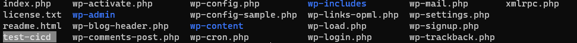
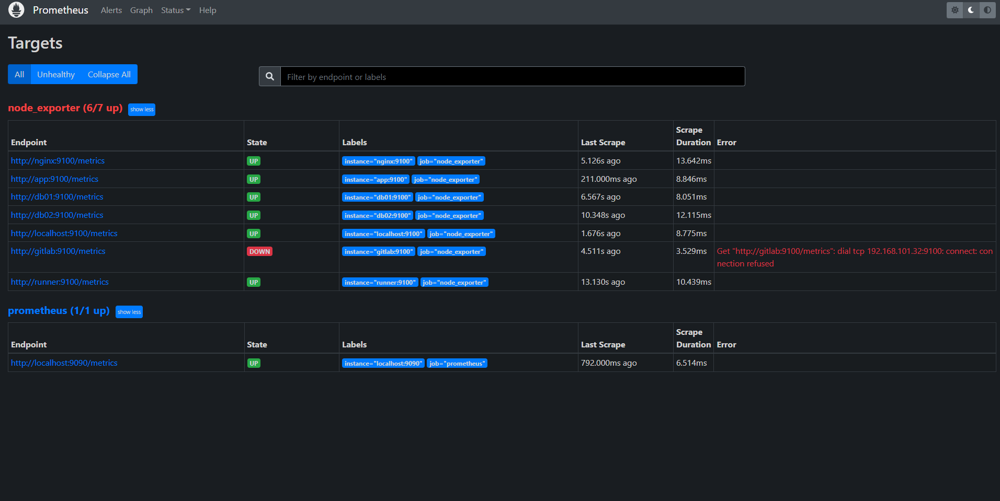
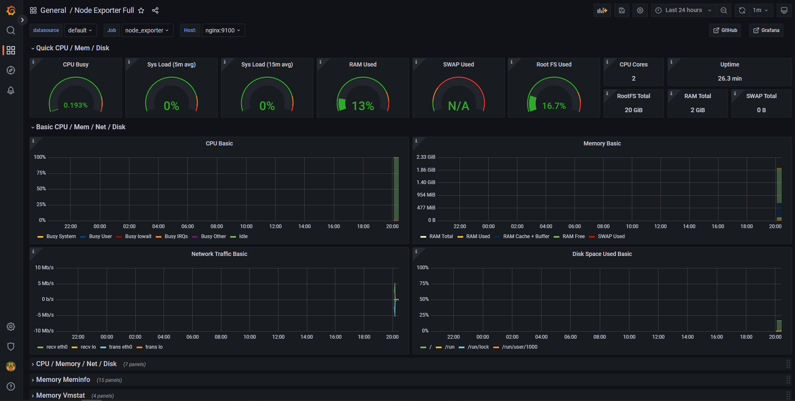
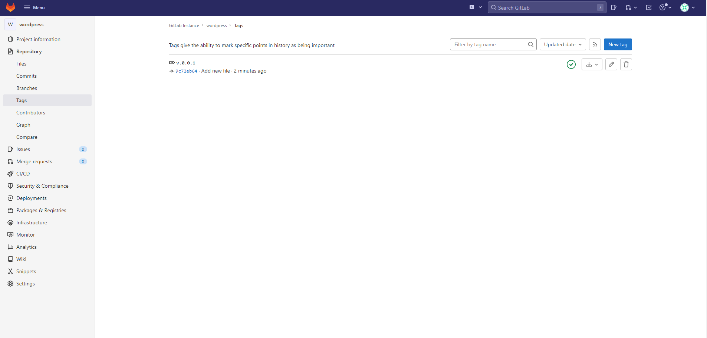
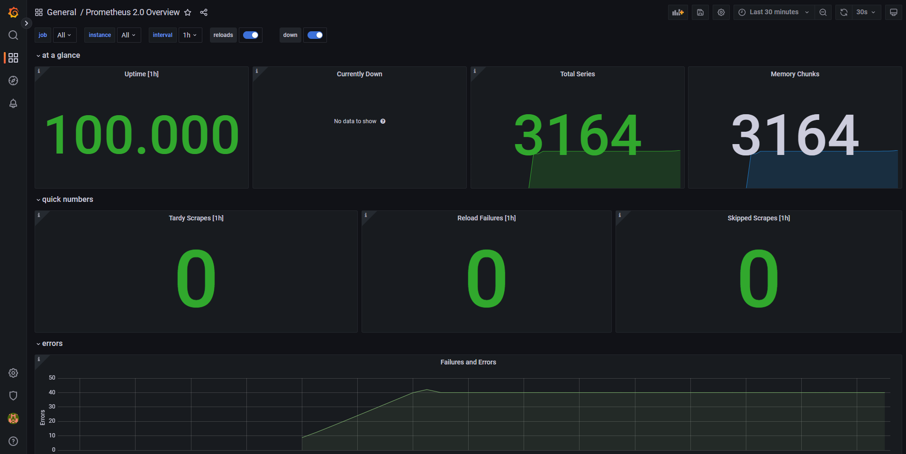

# Дипломный проект Devops-Netology

#### Ссылка на задание - <https://github.com/olegbukatchuk/devops-diplom-yandexcloud>

Этапы выполнения:

### 1. Регистрация доменного имени

Зарегистрировал доменное имя `rnsmetanin.ru` на REG.RU. Делегировал доменное имя yandexcloud, указав в настойках домена на reg.ru ns яндекса
`ns1.yandexcloud.net.` и `ns2.yandexcloud.net.`

### 2. Создание инфраструктуры

В YC заведен сервисный аккаунт, токен аккаунта (service account key) хранится в файле key.json, который располагается в корне папки terraform. Этот файл отсутствует в репозитории, так как добавлен в .gitignore

В качетсве backend используется S3 bucket YC

    backend "s3" {
        endpoint   = "storage.yandexcloud.net"
        bucket     = "nt-stage"
        region     = "ru-central1"
        key        = "terraform.tfstate"
        access_key = "YC***************"
        secret_key = "YC***************************"
        skip_region_validation      = true
        skip_credentials_validation = true
    }

Выбрана модель с одним workspace - stage

Завел VPC с подсетями в зонах `ru-central1-a` и `ru-central1-b`

### 3. Установка Nginx и LetsEncrypt

Разработана ansible role nginx. В ходе выполнения задач копируется простой html файл (для отладки), копируются и заменяются конфиг файлы nginx. Подробнее о роли - [nginx](ansible/roles/nginx "Роль nginx")

### 4. Установка кластера MySQL

Разработана ansible role mysql. VM db01 и db02 расположены в разных зонах, для отказоустойчивости.
Подробнее о роли - [mysql](ansible/roles/mysql "Роль mysql")

Примитивно изобразил HLD схему всего проекта

### 5. Установка WordPress

Разработана ansible role WordPress. Роль адаптирована для дипломного проекта, присутствуют таски для будущих заданий. Подробнее - [wordpress](ansible/roles/wordpress "Роль Wordpress")

### 6. Установка Gitlab CE и Gitlab Runner

* [Роль Gitlab](ansible/roles/gitlab "Роль Gitlab")
* [Роль Gitlab runner](ansible/roles/runner "Роль runner")

Проект в Gitlab создается вручную, после чего в репозиторий нового проекта копируются все файлы с сервера app из папки wordpress. Для работы runner при выполнении копируются ssh ключи (public и private) на VM Runner, а также копируется подготовленный файл autorization_keys на VM app

Единственный pipeline выглядит вот так:

        stages:          
        - deploy

        variables:
        $WORDPRESS_FOLDER: /var/www/app.rnsmetanin.ru/wordpress
        $DEPLOY_USER: runner
        $APP_SERVER: app.rnsmetanin.ru
        deploy-job:
        stage: deploy
        script:
            - ssh -o StrictHostKeyChecking=no $DEPLOY_USER@$APP_SERVER "sudo rm -rf $WORDPRESS_FOLDER*"
            - scp -o StrictHostKeyChecking=no -q -r $CI_PROJECT_DIR/* $DEPLOY_USER@$APP_SERVER:$WORDPRESS_FOLDER;

Для теста cicd в корень репозитория добавлен файл test-cicd. CI часть - pipeline автоматически стартует. CD часть - файл появился в папке wordpress на сервере app
 
Также задача выполняется и при проставлении тега.

### 7. Установка Prometheus, Alert Manager, Node Exporter и Grafana

* [Роль Prometheus](ansible/roles/prometheus "Роль Prometheus")
* [Роль Alert Manager](ansible/roles/alertmanager "Роль Alert Manager")
* [Роль Node Exporter](ansible/roles/node_exporter "Роль Node Exporter")
* [Роль Grafana](ansible/roles/grafana "Роль Grafana")

Для проверки мониторинга погасил одну VM. Prometheus все видит:

В grafana подключил источник даннах prometheus и импортировал дашборды:
* https://grafana.com/grafana/dashboards/1860
* https://grafana.com/grafana/dashboards/3662

### Еще снимки экранов

