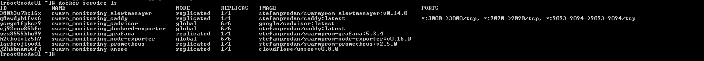

## Задача 1

Дайте письменные ответы на следующие вопросы:

###### В чём отличие режимов работы сервисов в Docker Swarm кластере: replication и global?

    Replica - означает что сервис будет реприцирован до заданного количества экземпляров. 
    (например нод может быть 10, а реплик указанного сервиса 5)

    Global - означает что сервис будет запускаться сразу же на всех нодах в кластере.
    (Например нод может быть 10, значит и реплик сервиса будет 10).

###### Какой алгоритм выбора лидера используется в Docker Swarm кластере?

    Каждая нода начинает свою жизнь в кластере в статусе follower, если нода не получает сигналов от мастера,
    то она может стать кандидатом, затем кандидат запрашивает голоса у других узлов и начинаются выборы, 
    тот кандидат, что получил большинство голосов и становится лидером.

###### Что такое Overlay Network?

    Overlay сеть - это сеть, которая дает кластеру единое пространство DNS имен. 

## Задача 2

Создать ваш первый Docker Swarm кластер в Яндекс.Облаке

Для получения зачета, вам необходимо предоставить скриншот из терминала (консоли), с выводом команды:
```
docker node ls
```

Готово:


## Задача 3

Создать ваш первый, готовый к боевой эксплуатации кластер мониторинга, состоящий из стека микросервисов.

Для получения зачета, вам необходимо предоставить скриншот из терминала (консоли), с выводом команды:
```
docker service ls
```
Готово:


## Задача 4 (*)

Выполнить на лидере Docker Swarm кластера команду (указанную ниже) и дать письменное описание её функционала, что она делает и зачем она нужна:
```
# см.документацию: https://docs.docker.com/engine/swarm/swarm_manager_locking/
docker swarm update --autolock=true
```


    Данные Docker swarm всегда зашифрованы (есть TLS ключ для "общения" нод, и есть ключ 
    для шифровки\дешифровки конфигурации Docker swarm). Если функция автоматической блокировки Docker swarm включена,
    то после перезагрузки swarm потребуется ввод мастер пароля, который был получен при выполнении команды 
    "docker swarm update --autolock=true", пока не будет введен пароль, кластер будет заблокирован и 
    при выполнении команд будет выводиться сообщение о необходимости разблокировки кластера. 
    Это повышает безопасность.
    В случае компрометации мастер пароля, его можно сменить командой "docker swarm unlock-key --rotate"
    