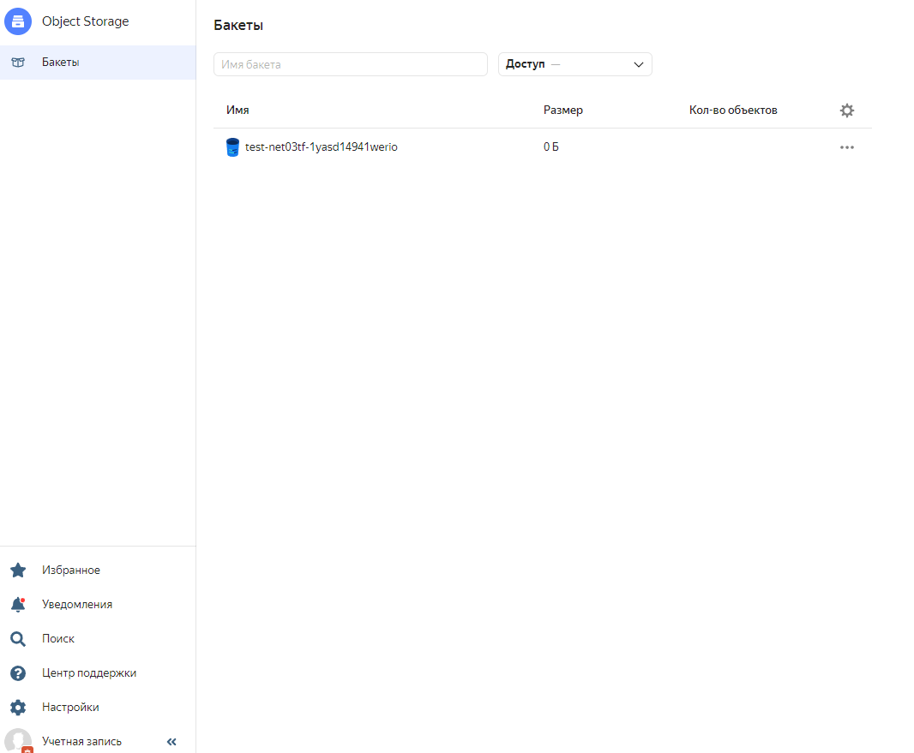

# Домашнее задание к занятию "7.3. Основы и принцип работы Терраформ"

## Задача 1. Создадим бэкэнд в S3 (необязательно, но крайне желательно).

Если в рамках предыдущего задания у вас уже есть аккаунт AWS, то давайте продолжим знакомство со взаимодействием
терраформа и aws. 

1. Создайте s3 бакет, iam роль и пользователя от которого будет работать терраформ. Можно создать отдельного пользователя,
а можно использовать созданного в рамках предыдущего задания, просто добавьте ему необходимы права, как описано 
[здесь](https://www.terraform.io/docs/backends/types/s3.html).
1. Зарегистрируйте бэкэнд в терраформ проекте как описано по ссылке выше. 

Ответ:

Создан Бакет (Yandex Object Storage) по [инструкции](https://cloud.yandex.ru/docs/storage/operations/buckets/create).
Конфиг main.tf выглядит вот так:
   
      resource "yandex_storage_bucket" "test-net03tf-1yasd14941werio" {
         access_key = "*******************"
         secret_key = "***********************************************"
         bucket = "test-net03tf-1yasd14941werio"
      }

Вывод команды terraform plan:

      Terraform used the selected providers to generate the following execution plan. 
      Resource actions are indicated with the following symbols:
      + create

      Terraform will perform the following actions:

      # yandex_storage_bucket.test-net03tf-1yasd14941werio will be created
      + resource "yandex_storage_bucket" "test-net03tf-1yasd14941werio" {
         + access_key            = "my_key"
         + acl                   = "private"
         + bucket                = "test-net03tf-1yasd14941werio"
         + bucket_domain_name    = (known after apply)
         + default_storage_class = (known after apply)
         + folder_id             = (known after apply)
         + force_destroy         = false
         + id                    = (known after apply)
         + secret_key            = (sensitive value)
         + website_domain        = (known after apply)
         + website_endpoint      = (known after apply)
   
         + anonymous_access_flags {
             + list = (known after apply)
             + read = (known after apply)
           }
   
         + versioning {
             + enabled = (known after apply)
           }
       }

      Plan: 1 to add, 0 to change, 0 to destroy.

И после выполнения terraform apply в yc появляется бакет:

   
      

## Задача 2. Инициализируем проект и создаем воркспейсы. 

1. Выполните `terraform init`:
    * если был создан бэкэнд в S3, то терраформ создат файл стейтов в S3 и запись в таблице 
dynamodb.
    * иначе будет создан локальный файл со стейтами.  
2. Создайте два воркспейса `stage` и `prod`.
3. В уже созданный `aws_instance` добавьте зависимость типа инстанса от вокспейса, что бы в разных ворскспейсах 
использовались разные `instance_type`.
4. Добавим `count`. Для `stage` должен создаться один экземпляр `ec2`, а для `prod` два. 

      `resource "yandex_compute_instance" "vm-1" {`\
         `count = "${terraform.workspace == "prod" ? 2 : 1}"`\
         `name = "node0${count.index+1}-${terraform.workspace}"`\
         `resources {`\
            `cores         = "${terraform.workspace == "prod" ? 4 : 2}"`\
            `memory        = 4`\
         `}`\
         `...`\
      `}`
    

5. Создайте рядом еще один `aws_instance`, но теперь определите их количество при помощи `for_each`, а не `count`.

Создал переменную hosts, в которой указаны параметра vm для каждого workspace

      variable "hosts" {
        type = map(map(map(string)))
        default = {
         prod = {
           vm1 = {
             name = "node01-fe-prod"
             cores = "4"
           }
           vm2 = {
             name = "node02-fe-prod"
             cores = "4"
           }
   
       }
         stage = {
           vm1 = {
             name = "node1-fe-stage"
             cores = "2"
           }
         }

И в файле main.tf добавил еще один instance:

     resource "yandex_compute_instance" "fe" {
        for_each = var.hosts[terraform.workspace]
        name = each.value.name
      
        resources {
          cores         = each.value.cores
          memory        = 4
        }
     ...
      }

6. Что бы при изменении типа инстанса не возникло ситуации, когда не будет ни одного инстанса добавьте параметр
жизненного цикла `create_before_destroy = true` в один из рессурсов `aws_instance`.

Добавил в resource "yandex_compute_instance" "vm-1" 

      lifecycle {
         create_before_destroy = true
      }   
   
7. При желании поэкспериментируйте с другими параметрами и рессурсами.

В виде результата работы пришлите:
* Вывод команды `terraform workspace list`.

      root@vagrant:/home/vagrant/terraform/tf03# terraform workspace list\
      default
      * prod
      stage
    
* Вывод команды `terraform plan` для воркспейса `prod`.  

   
      root@vagrant:/home/vagrant/terraform/tf03# terraform workspace select prod
      Switched to workspace "prod".
      root@vagrant:/home/vagrant/terraform/tf03# terraform plan
      data.yandex_compute_image.my_image: Reading...
      data.yandex_compute_image.my_image: Read complete after 1s [id=fd8mn5e1cksb3s1pcq12]

      Terraform used the selected providers to generate the following execution plan. Resource actions are indicated with the
      following symbols:
      + create

      Terraform will perform the following actions:

      # yandex_compute_instance.fe["vm1"] will be created
      + resource "yandex_compute_instance" "fe" {
      + created_at                = (known after apply)
      + folder_id                 = (known after apply)
      + fqdn                      = (known after apply)
      + hostname                  = (known after apply)
      + id                        = (known after apply)
      + metadata                  = {
          + "ssh-keys" = <<-EOT
                ubuntu:ssh-rsa ${file("~/.ssh/id_rsa.pub")}
            EOT
        }
      + name                      = "node01-fe-prod"
      + network_acceleration_type = "standard"
      + platform_id               = "standard-v1"
      + service_account_id        = (known after apply)
      + status                    = (known after apply)
      + zone                      = (known after apply)

      + boot_disk {
          + auto_delete = true
          + device_name = (known after apply)
          + disk_id     = (known after apply)
          + mode        = (known after apply)

          + initialize_params {
              + block_size  = (known after apply)
              + description = (known after apply)
              + image_id    = "fd8mn5e1cksb3s1pcq12"
              + name        = (known after apply)
              + size        = (known after apply)
              + snapshot_id = (known after apply)
              + type        = "network-hdd"
            }
        }

      + network_interface {
          + index              = (known after apply)
          + ip_address         = (known after apply)
          + ipv4               = true
          + ipv6               = (known after apply)
          + ipv6_address       = (known after apply)
          + mac_address        = (known after apply)
          + nat                = true
          + nat_ip_address     = (known after apply)
          + nat_ip_version     = (known after apply)
          + security_group_ids = (known after apply)
          + subnet_id          = (known after apply)
        }

      + placement_policy {
          + host_affinity_rules = (known after apply)
          + placement_group_id  = (known after apply)
        }

      + resources {
          + core_fraction = 100
          + cores         = 4
          + memory        = 4
        }

      + scheduling_policy {
          + preemptible = (known after apply)
        }
      }

      yandex_compute_instance.fe["vm2"] will be created
      + resource "yandex_compute_instance" "fe" {
      + created_at                = (known after apply)
      + folder_id                 = (known after apply)
      + fqdn                      = (known after apply)
      + hostname                  = (known after apply)
      + id                        = (known after apply)
      + metadata                  = {
          + "ssh-keys" = <<-EOT
                ubuntu:ssh-rsa ${file("~/.ssh/id_rsa.pub")}
            EOT
        }
      + name                      = "node02-fe-prod"
      + network_acceleration_type = "standard"
      + platform_id               = "standard-v1"
      + service_account_id        = (known after apply)
      + status                    = (known after apply)
      + zone                      = (known after apply)

      + boot_disk {
          + auto_delete = true
          + device_name = (known after apply)
          + disk_id     = (known after apply)
          + mode        = (known after apply)

          + initialize_params {
              + block_size  = (known after apply)
              + description = (known after apply)
              + image_id    = "fd8mn5e1cksb3s1pcq12"
              + name        = (known after apply)
              + size        = (known after apply)
              + snapshot_id = (known after apply)
              + type        = "network-hdd"
            }
        }

      + network_interface {
          + index              = (known after apply)
          + ip_address         = (known after apply)
          + ipv4               = true
          + ipv6               = (known after apply)
          + ipv6_address       = (known after apply)
          + mac_address        = (known after apply)
          + nat                = true
          + nat_ip_address     = (known after apply)
          + nat_ip_version     = (known after apply)
          + security_group_ids = (known after apply)
          + subnet_id          = (known after apply)
        }

      + placement_policy {
          + host_affinity_rules = (known after apply)
          + placement_group_id  = (known after apply)
        }

      + resources {
          + core_fraction = 100
          + cores         = 4
          + memory        = 4
        }

      + scheduling_policy {
          + preemptible = (known after apply)
        }
      }

      yandex_compute_instance.vm-1[0] will be created
      + resource "yandex_compute_instance" "vm-1" {
      + created_at                = (known after apply)
      + folder_id                 = (known after apply)
      + fqdn                      = (known after apply)
      + hostname                  = (known after apply)
      + id                        = (known after apply)
      + metadata                  = {
          + "ssh-keys" = <<-EOT
                ubuntu:ssh-rsa ${file("~/.ssh/id_rsa.pub")}
            EOT
        }
      + name                      = "node01-prod"
      + network_acceleration_type = "standard"
      + platform_id               = "standard-v1"
      + service_account_id        = (known after apply)
      + status                    = (known after apply)
      + zone                      = (known after apply)

      + boot_disk {
          + auto_delete = true
          + device_name = (known after apply)
          + disk_id     = (known after apply)
          + mode        = (known after apply)

          + initialize_params {
              + block_size  = (known after apply)
              + description = (known after apply)
              + image_id    = "fd8mn5e1cksb3s1pcq12"
              + name        = (known after apply)
              + size        = (known after apply)
              + snapshot_id = (known after apply)
              + type        = "network-hdd"
            }
        }

      + network_interface {
          + index              = (known after apply)
          + ip_address         = (known after apply)
          + ipv4               = true
          + ipv6               = (known after apply)
          + ipv6_address       = (known after apply)
          + mac_address        = (known after apply)
          + nat                = true
          + nat_ip_address     = (known after apply)
          + nat_ip_version     = (known after apply)
          + security_group_ids = (known after apply)
          + subnet_id          = (known after apply)
        }

      + placement_policy {
          + host_affinity_rules = (known after apply)
          + placement_group_id  = (known after apply)
        }

      + resources {
          + core_fraction = 100
          + cores         = 4
          + memory        = 4
        }

      + scheduling_policy {
          + preemptible = (known after apply)
        }
      }

      yandex_compute_instance.vm-1[1] will be created
      + resource "yandex_compute_instance" "vm-1" {
      + created_at                = (known after apply)
      + folder_id                 = (known after apply)
      + fqdn                      = (known after apply)
      + hostname                  = (known after apply)
      + id                        = (known after apply)
      + metadata                  = {
          + "ssh-keys" = <<-EOT
                ubuntu:ssh-rsa ${file("~/.ssh/id_rsa.pub")}
            EOT
        }
      + name                      = "node02-prod"
      + network_acceleration_type = "standard"
      + platform_id               = "standard-v1"
      + service_account_id        = (known after apply)
      + status                    = (known after apply)
      + zone                      = (known after apply)

      + boot_disk {
          + auto_delete = true
          + device_name = (known after apply)
          + disk_id     = (known after apply)
          + mode        = (known after apply)

          + initialize_params {
              + block_size  = (known after apply)
              + description = (known after apply)
              + image_id    = "fd8mn5e1cksb3s1pcq12"
              + name        = (known after apply)
              + size        = (known after apply)
              + snapshot_id = (known after apply)
              + type        = "network-hdd"
            }
        }

      + network_interface {
          + index              = (known after apply)
          + ip_address         = (known after apply)
          + ipv4               = true
          + ipv6               = (known after apply)
          + ipv6_address       = (known after apply)
          + mac_address        = (known after apply)
          + nat                = true
          + nat_ip_address     = (known after apply)
          + nat_ip_version     = (known after apply)
          + security_group_ids = (known after apply)
          + subnet_id          = (known after apply)
        }

      + placement_policy {
          + host_affinity_rules = (known after apply)
          + placement_group_id  = (known after apply)
        }

      + resources {
          + core_fraction = 100
          + cores         = 4
          + memory        = 4
        }

      + scheduling_policy {
          + preemptible = (known after apply)
        }
      }

      yandex_vpc_network.network-1 will be created
      + resource "yandex_vpc_network" "network-1" {
      + created_at                = (known after apply)
      + default_security_group_id = (known after apply)
      + folder_id                 = (known after apply)
      + id                        = (known after apply)
      + labels                    = (known after apply)
      + name                      = "network1"
      + subnet_ids                = (known after apply)
      }

      yandex_vpc_subnet.subnet-1 will be created
      + resource "yandex_vpc_subnet" "subnet-1" {
      + created_at     = (known after apply)
      + folder_id      = (known after apply)
      + id             = (known after apply)
      + labels         = (known after apply)
      + name           = "subnet1"
      + network_id     = (known after apply)
      + v4_cidr_blocks = [
          + "192.168.10.0/24",
        ]
      + v6_cidr_blocks = (known after apply)
      + zone           = "ru-central1-a"
      }

      Plan: 6 to add, 0 to change, 0 to destroy.
   
      ───────────────────────────────────────────────────────────────────────────────────────────────────────────────────────

В результате выполнения terraform apply в YC создается 4 VM (2 count и 2 foreach)

Если переключиться на workspace stage, то будет создано 2 vm

